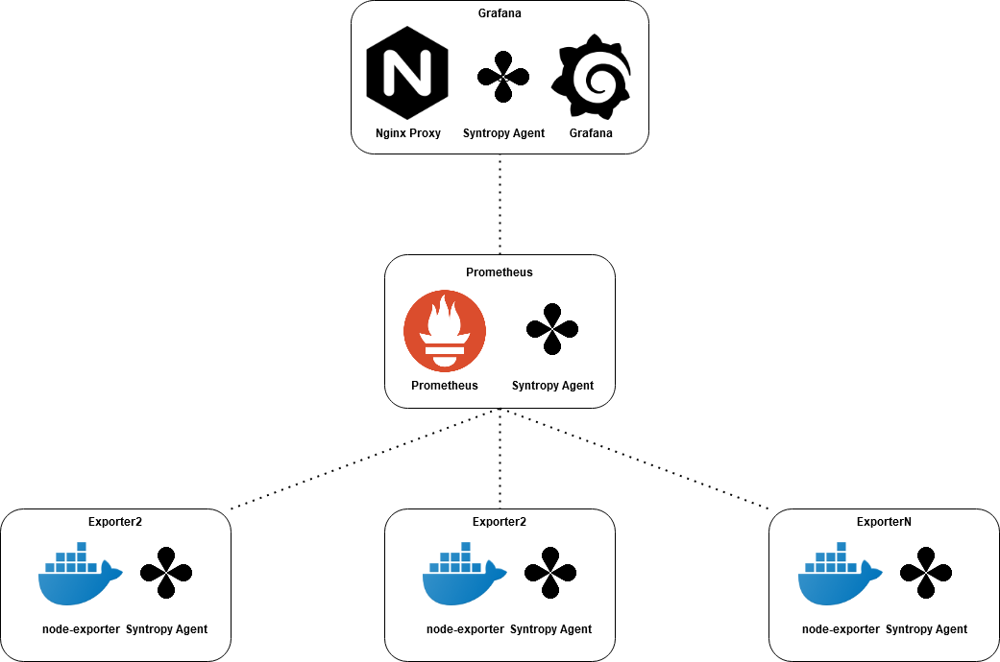

# Syntropy based monitoring stack

These ansible-playbooks and related files are for semi-automated monitoring stack (Grafana, Prometheus, node-exporter) deployment utilizing simplicity of network configuration provided by Syntropy agent and command line utilities.

The best part is that these playbooks will allow you to easily scale your monitoring setup for multiple remote node-exporters by automatically creating required non-overlapping docker networks and auto-generating Prometheus scrape config targets (based on your node-exporter ansible hosts in the inventory). It will also provisions Grafana datasource and dashboards to be used with Prometheus and node-exporter. Therefore you can begin using this monitoring stack out of the box!

All the network traffic is being handled by Syntropy Agent connections - secure encrypted tunnels based on Wireguard. This network scheme is being managed by Syntropy Platform, which allows easily device connections and networks both using CLI and WEB UI.

All the services are running as docker containers inside virtual servers:
```
a) Nginx works as proxy for Grafana WEB UI
b) Grafana datasource is Prometheus
c) Prometheus scrape targets are node-exporter containers
```

This connection configuration can be scaled up to 253 node-exporters with no additional effort or editing.

<center></center>


## What is Syntropy?

Syntropy stack is software which lets you to easily establish VPN connections between remote endpoints, implement network-as-a-code approach and to avoid complex and inefficient network firewall and routing setups.

## Requirements

- Debian/Ubuntu based distro and dependencies installed and ansible server configured. 
- You will also need to register for Syntropy account here: https://platform.syntropystack.com
- Wireguard kernel module is required if you are running kernel older than 5.6. More details here: https://docs.syntropystack.com/docs/start-syntropy-agent
- Domain client hostnames must be compatible with Active Directory - more details at https://docs.microsoft.com/en-us/troubleshoot/windows-server/identity/naming-conventions-for-computer-domain-site-ou
- Syntropy CLI tool installed

## Dependencies

These are required for Syntropy network management via CLI:

```
apt install ansible
apt install python3
apt install python3-pip
pip install git+https://github.com/SyntropyNet/syntropy-cli#egg=syntropycli
```

## How to run

Get it running by 3 steps explained below:

1) Register for Syntropy account and get API token and API key.
2) Prepare the code and variables
3) Run asible-playbook

### Step1 - Register for Syntropy account and get API token and API key

API key can be created at 
```
export SYNTROPY_API_SERVER=https://controller-prod-server.syntropystack.com
syntropyctl login your@account.com
Password: **********
```

### Step2 - Update variables

Update the variables in main.yml at the top directory:

```
Deploy Samba task:
cloud provider - cloud provider for samba server check your ID here
api_key -use API key for Syntropy Platform web UI
domain - your new domain name in uppercase
domainpass - your domain admin password
workgroup - recomended to be subdomain of domain in uppercase
dns_forwarder - where to forward DNS queries outside of domain

Deploy Syntropy agents task:
cloud provider - cloud provider for domain client servers, check your ID here
api_key - use API key for Syntropy Platform web UI (can be same)
syntropy_network_name - choose a name for your Syntropy network

Setup Syntropy network:
api_token - API token string you got form prerequisites step 7

Setup domain client task:
dc_ip - IP address of domain controller (should be same as in Deploy Samba task)
domain - your new domain name in uppercase
domainpass - your domain admin password (should be same as in Deploy Samba task)
workgroup - recomended to be subdomain of domain in uppercase(should be same as in Deploy Samba task)
allowed_group_name - AD group name which will have acess to newly joined domain client servers
```

### Step3 - Run the playbook

Just run this command:
```
ansible-playbook main.yaml
```
Visit the Platform WEB UI to check you network: 

https://platform.syntropystack.com

That's it! You can try out your newly created your new Samba AD domain and joined clients using secure Syntropy network!
